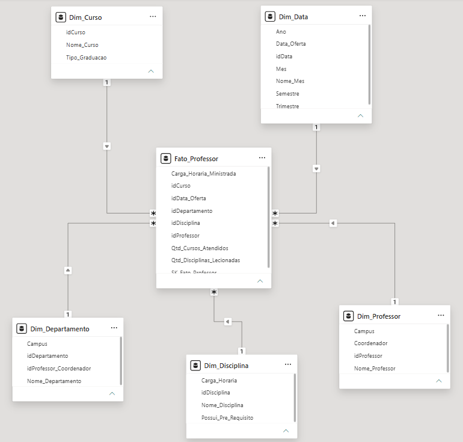

# Processo de Modelagem Dimensional – Star Schema para Análise de Professores

Este repositório contém a solução do desafio de construção de um **Star Schema (Esquema em Estrela)** com foco no objeto de análise **Professor**, desenvolvido para o bootcamp de Power BI da DIO.

## 📐 Diagrama do Modelo Star Schema



---

## 📌 Objetivo do Desafio
Transformar um diagrama relacional de uma universidade em um modelo dimensional otimizado. O foco principal da análise são os **Professores**, seus cursos ministrados, departamentos e datas de oferta de disciplinas. Conforme orientado no desafio, os dados referentes a alunos foram desconsiderados na modelagem.

---

## 🏗️ Estrutura do Modelo Dimensional

### **1. Tabela Fato (`Fato_Professor`)**
Contém as métricas de ensino, carga horária e os eventos de lecionação do professor:
* `SK_Fato_Professor` (Surrogate Key)
* `idProfessor` (FK - Dim_Professor)
* `idDepartamento` (FK - Dim_Departamento)
* `idDisciplina` (FK - Dim_Disciplina)
* `idCurso` (FK - Dim_Curso)
* `idData_Oferta` (FK - Dim_Data)
* `Carga_Horaria_Ministrada` (Métrica)
* `Qtd_Disciplinas_Lecionadas` (Métrica)
* `Qtd_Cursos_Atendidos` (Métrica)

---

### **2. Tabelas Dimensão**

* **`Dim_Professor`**
  * `idProfessor` (PK)
  * `Nome_Professor`
  * `Campus`
  * `Coordenador` (Sim/Não)

* **`Dim_Departamento`**
  * `idDepartamento` (PK)
  * `Nome_Departamento`
  * `Campus`
  * `idProfessor_Coordenador`

* **`Dim_Disciplina`**
  * `idDisciplina` (PK)
  * `Nome_Disciplina`
  * `Carga_Horaria`
  * `Possui_Pre_Requisito` (Sim/Não)

* **`Dim_Curso`**
  * `idCurso` (PK)
  * `Nome_Curso`
  * `Tipo_Graduacao`

* **`Dim_Data` (Dimensão de Datas Criada)**
  * `idData` (PK)
  * `Data_Oferta`
  * `Ano`
  * `Semestre`
  * `Trimestre`
  * `Mes`
  * `Nome_Mes`

---

## 🛠️ Etapas do Projeto
1. **Análise do Diagrama Relacional:** Identificação das entidades relacionadas ao Professor (Departamento, Disciplina, Curso).
2. **Exclusão do Escopo de Alunos:** Remoção das tabelas `Aluno` e `Matriculado` para otimização do modelo relacional em estrela.
3. **Criação da Dimensão Data:** Adição de campos temporais de oferta de disciplinas e cursos para habilitar inteligência de tempo no Power BI.
4. **Definição de Granularidade e Chaves:** Mapeamento de Primary Keys (PK), Foreign Keys (FK) e criação da Surrogate Key na tabela Fato.
5. **Configuração de Relacionamentos:** Estabelecimento de conexões `1:N` (Um para Muitos) da Fato para as Dimensões no ambiente de modelagem do Power BI.

---

## 📂 Organização do Repositório

```text
desafio-star-schema-universidade-powerbi/
│
├── 📁 pbix/
│   └── Modelagem_StarSchema_Universidade.pbix
│
├── 📁 imagens/
│   └── Diagrama_Star_Schema.png
│
└── README.md
